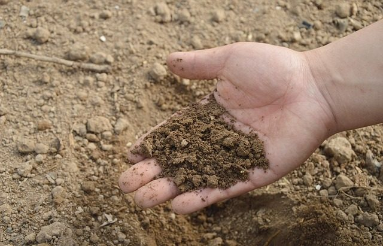

  

  
  
  

  

  Analisa Uji Kelayakan Tanah dengan menggunakan Decision Tree.
    
  <em>Dataset by <a href="https://kaggle.com">Kaggle</a>.</em>

    
# Latar Belakang

[House Price Clustering](https://github.com/habibarrsyd/analyze-suitablity-soil) 
Kualitas tanah adalah faktor penting dalam mendukung keberhasilan pertanian, di mana aspek seperti drainase, bahan organik, kelembapan, dan pH tanah sangat memengaruhi kesuburan dan produktivitas. Pengelolaan yang buruk terhadap faktor-faktor ini dapat menurunkan kualitas tanah dan hasil panen. Dengan kemajuan teknologi, metode analisis seperti *decision tree* menjadi alat yang efektif untuk mengevaluasi kesesuaian tanah berdasarkan data. Pendekatan ini membantu petani memahami pola dan mengambil keputusan yang tepat untuk meningkatkan kualitas tanah, sehingga mendukung efisiensi dan keberlanjutan pertanian.
## Tools
[`^ kembali ke atas ^`](#)

### Software yang digunakan :
- Sistem Operasi: Linux Ubuntu/Windows/Mac OS
- Bahasa : Python Language Programming
- Text Editor : Google Collaboratory atau Visual Studio Code

### Proses :
#### Baca Data
- 
#### Bagi harga dengan integer 1000000 untuk mempermudah pembacaan
- 
#### Ambil data yang dapat mewakili populasi yang akan dilakukan klastering
- 
#### Gunakan elbow method untuk menentukan banyak klaster
- 
#### Gunakan Kmeans 4 Klaster
- 
#### Visualisasi Plot Klaster
- 
#### Tunjukkan klaster terbentuk
- 
#### Data rumah yang sudah ter-klaster
- 

