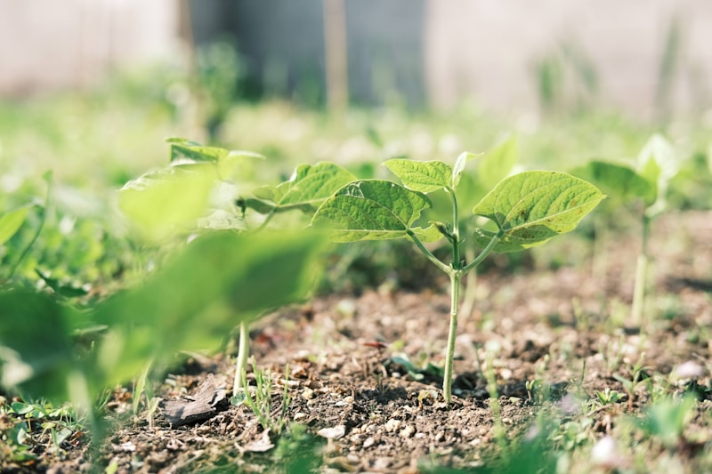

  

  
  
  

  

  Analisa Uji Kelayakan Tanah dengan menggunakan Decision Tree.
    
  <em>Dataset by <a href="https://kaggle.com">Kaggle</a>.</em>

    
# Latar Belakang

[Decision Tree for Analyze suitability soil](https://github.com/habibarrsyd/analyze-suitablity-soil) 
Kualitas tanah adalah faktor penting dalam mendukung keberhasilan pertanian, di mana aspek seperti drainase, bahan organik, kelembapan, dan pH tanah sangat memengaruhi kesuburan dan produktivitas. Pengelolaan yang buruk terhadap faktor-faktor ini dapat menurunkan kualitas tanah dan hasil panen. Dengan kemajuan teknologi, metode analisis seperti *decision tree* menjadi alat yang efektif untuk mengevaluasi kesesuaian tanah berdasarkan data. Pendekatan ini membantu petani memahami pola dan mengambil keputusan yang tepat untuk meningkatkan kualitas tanah, sehingga mendukung efisiensi dan keberlanjutan pertanian.
## Tools
[`^ kembali ke atas ^`](#)

### Software yang digunakan :
- Sistem Operasi: Linux Ubuntu/Windows/Mac OS
- Bahasa : Python Language Programming
- Text Editor : Google Collaboratory atau Visual Studio Code

## Proses :
### Baca Data
- 
### PREPROCESSING
#### Lihat Deskripsi Data
- 
#### Cek Kekosongan Data
- 
#### Encoding (Ubah Kategorikal jadi Numerikal)
- 

### Analyze
#### Import dan Aplikasikan Model
- 
#### Visualisasikan Tree yang Terbentuk
- 
#### Evaluasi Metrik Pengujian
- 

## Conclusion
Decision Tree bekerja dengan membagi data berdasarkan aturan hierarkis menggunakanfiturfitur tertentu. Pada node awal (root), fitur pertama yang digunakan adalah Drainage Quality. Jika nilai Drainage Quality <= 0.5, semua sampel langsung diklasifikasikan sebagai Not Suitable karena pada node ini entropy bernilai 0.0, yang berarti semua data di cabangtersebut termasuk dalam kelas yang sama. Namun, jika Drainage Quality > 0.5, keputusan dilanjutkanke node berikutnya menggunakan fitur pH Level. Pada tahap ini, jika pHLevel <=5.95, sampel juga diklasifikasikan sebagai Not Suitable (entropy = 0). Sebaliknya, jika pHLevel >5.95, data akan diperiksa lebih lanjut ke level berikutnya. Cabang lebih dalam melibatkan fitur Moisture Content (%). Jika Moisture Content (%) <=34.5, data langsung diklasifikasikan sebagai Not Suitable. Namun, jika nilai ini lebihbesar, model melanjutkan dengan memeriksa fitur Organic Matter (%). Keputusan akhir dibuat di leaf node, di mana setiap sampel diklasifikasikan berdasarkan mayoritas kelas pada datayangmencapai node tersebut. Misalnya, jika Organic Matter (%) <= 3.1, tanah dianggap Suitable, sedangkan jika nilainya lebih besar, tanah tetap diklasifikasikan sebagai Not Suitable. Prosesini memastikan bahwa setiap data baru dapat dipetakan ke dalam kategori yang sesuai secarasistematis.

